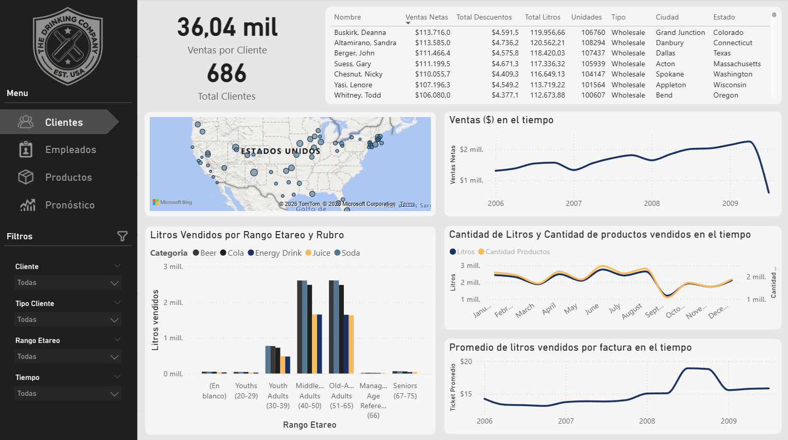

# ETL Pipeline to Datawarehouse — The Drinking Company (TDC)

## Introducción

**The Drinking Company (TDC)** es una empresa productora y comercializadora de bebidas que opera en múltiples regiones de Estados Unidos. La compañía genera datos desde tres áreas de negocio principales: **Marketing**, **Recursos Humanos** y **Producción**, cada una con sus propios formatos y sistemas de almacenamiento. El objetivo de este proyecto es construir un pipeline ETL que centralice, limpie y transforme estos datos heterogéneos en un **Data Warehouse** con un modelo estrella, para luego ser visualizado en un dashboard de **Power BI**.


---

## Fuentes de datos

Los datos de origen provienen de tres áreas distintas, cada una con formatos variados:

| Área | Archivo | Formato | Contenido |
|------|---------|---------|-----------|
| Marketing | `Customer_R.xml` | XML | Clientes minoristas |
| Marketing | `Customer_W.xml` | XML | Clientes mayoristas |
| Marketing | `Regions.txt` | TXT (delimitado por `\|`) | Regiones, estados, ciudades y códigos postales |
| Marketing | `TDChistorySales_2019.bak` | MS SQL Server 2000 | Ventas historicas (billing) |
| Marketing | `Sales` | MySQL | Ventas actuales (billing, billing_detail, discounts, prices) |
| RRHH | `Employee.xls` | Excel (.xls) | Empleados con datos personales y laborales |
| RRHH | `Holidays.xls` | Excel (.xls) | Feriados calendario |
| Producción | `Products.txt` | TXT (delimitado por `\|`) | Catálogo de productos con nombre y presentación |
| Producción | `Stock.txt` | TXT | Variaciones de stock por producto y fecha |

---

## Arquitectura del pipeline ETL

El pipeline sigue una arquitectura de **3 capas**:


### 1. Capa Staging (`bd_staging_2025_G01`)

Base de datos de aterrizaje donde se cargan los datos crudos desde las fuentes originales sin transformación. Contiene 12 tablas que reflejan fielmente la estructura de origen:

| Tabla Staging | Origen |
|---------------|--------|
| `stg_Billing_G01` | Cabeceras de facturación |
| `stg_BillingDetail_G01` | Detalle de facturación (productos por factura) |
| `stg_BillingHistory_G01` | Historial plano de ventas |
| `stg_CustomerR_G01` | Clientes minoristas (XML) |
| `stg_CustomerW_G01` | Clientes mayoristas (XML) |
| `stg_Discounts_G01` | Descuentos por monto acumulado |
| `stg_Employee_G01` | Empleados (Excel) |
| `stg_Holidays_G01` | Feriados (Excel) |
| `stg_Prices_G01` | Precios históricos por producto |
| `stg_Products_G01` | Productos (TXT) |
| `stg_Regions_G01` | Regiones (TXT) |
| `stg_Stock_G01` | Variación de stock (TXT) |

### 2. Capa Intermedia (`bd_intermedia_2025_G01`)

Base de datos donde se unifican y limpian los datos. Aquí ocurren las principales transformaciones:

- **`int_Customers_G01`**: Unifica los clientes minoristas (Customer_R) y mayoristas (Customer_W) en una sola tabla, agregando el campo `CUSTOMER_TYPE` para distinguirlos (`'Retail'` / `'Wholesale'`). Las fechas de nacimiento se transforman de texto a tipo `date`.
- **`int_SalesUnified_G01`**: Unifica las ventas provenientes de `stg_Billing` + `stg_BillingDetail` y de `stg_BillingHistory` en una sola tabla, con un campo `SOURCE` que indica el origen de cada registro.

### 3. Data Warehouse (`datawarehouse_2025_G01`)

Base de datos final con modelo estrella, optimizada para consultas analíticas.

---

## Modelo del Data Warehouse (Esquema Estrella)


### Dimensiones

| Tabla | Clave | Atributos principales |
|-------|-------|-----------------------|
| `Dim_Cliente_G01` | `customerKey` (IDENTITY) | customerId, fullName, birthDate, customerType (Retail/Wholesale), city, state, zipcode |
| `Dim_Producto_G01` | `productKey` (IDENTITY) | productId, productName, category, package, packageType, packageSizeMl, packageSizeLiters, isDiet, isCan, isBottle |
| `Dim_Empleado_G01` | `employeeKey` (IDENTITY) | employeeId, fullName, gender, category, employmentDate, birthDate, age, ageRangeKey, educationLevel, yearsEmployed, seniorityGroup |
| `Dim_Region_G01` | `regionKey` (IDENTITY) | region, regionDescription, state, city, zipcode |
| `Dim_Fecha_G01` | `dateKey` (INT) | fullDate, day, month, quarter, year, dayOfWeek, dayName, monthName, isHoliday, holidayName, weekOfYear, semester |
| `Dim_RangoEtario_G01` | `ageRangeKey` (IDENTITY) | rangeDescription, expandedRangeDescription, minAge, maxAge |

### Tablas de Hechos

| Tabla | Granularidad | Medidas | Claves foráneas |
|-------|-------------|---------|-----------------|
| `Fact_Ventas_G01` | Una fila por línea de factura | quantity, liters, unitPrice, grossAmount, discountPercentage, discountAmount, netAmount | dateKey, customerKey, productKey, employeeKey, regionKey, customerAgeRangeKey |
| `Fact_Stock_G01` | Una fila por producto/fecha | variation, stockBalance | dateKey, productKey |

### Relaciones

La tabla `Fact_Ventas` se relaciona con las dimensiones a través de foreign keys:
- `dateKey` → `Dim_Fecha_G01`
- `customerKey` → `Dim_Cliente_G01`
- `productKey` → `Dim_Producto_G01`
- `employeeKey` → `Dim_Empleado_G01`
- `regionKey` → `Dim_Region_G01`
- `customerAgeRangeKey` → `Dim_RangoEtario_G01`

La tabla `Fact_Stock` se relaciona con `Dim_Fecha` y `Dim_Producto`.

---

## Orquestación con SSIS

Los paquetes SSIS se encuentran en `ssis/ETL_TDC_2025_G01/` y se ejecutan mediante un **orquestador** (`00_Orquestador.dtsx`) que controla el flujo completo:

```
00_Clean_DW (limpia datos existentes)
    → 01_Dim_Cliente (clientes)
    → 02_Dim_Producto (productos)
    → 03_Dim_Empleado (empleados)
    → 04_Dim_Region (regiones)
    → 05_Dim_Fecha (calendario con feriados)
    → 06_Dim_RangoEtario (rangos de edad)
    → 07_Fact_Stock (hechos de stock)
    → 08_Fact_Ventas (hechos de ventas)
```

Cada paquete se encarga de:
1. **Extraer** los datos desde la capa de staging
2. **Transformar** según la lógica de negocio correspondiente
3. **Cargar** en la tabla de destino del Data Warehouse

---

## Dashboard Power BI

El dashboard final (`powerbi/tp_bbdd2_2025_G01.pbix`) consume los datos del Data Warehouse y expone los principales KPIs del negocio:

- Ventas totales, descuentos aplicados y monto neto
- Cantidad de litros vendidos
- Evolución temporal de ventas y stock
- Segmentación por cliente, producto, empleado y región
- Rentabilidad por categoría de producto
- Análisis de descuentos y su impacto



---

## Tecnologías utilizadas

| Herramienta | Versión | Uso |
|-------------|---------|-----|
| **SQL Server Managment Studio (SSMS)** | 2022 | Bases de datos (Staging, Intermedia, DW) |
| **SQL Server Integration Services (SSIS)** | 2026 | Paquetes ETL |
| **Power BI Desktop** | — | Visualización y dashboard |
| **MySQL Workbench** | 8.0 | Base de datos fuente (historial de ventas) |
| **Excel** | — | Fuente de datos (empleados, feriados) |
| **XML** | — | Fuente de datos (clientes) |
| **Archivos planos TXT** | — | Fuente de datos (productos, regiones, stock) |

---

## Estructura del repositorio

```
BBDD2-COM1-TPFinal-PorcelliFabricio/
├── sources/                            # Datos de origen
│   ├── marketing_area/                 # Marketing (clientes XML, regiones TXT, ventas MySQL)
│   ├── human_resources_area/           # RRHH (empleados XLS, feriados XLS)
│   └── production_area/                # Producción (productos TXT, stock TXT)
├── scripts/                            # Scripts SQL de creación de tablas
│   ├── bd_staging_2025_G01/            # Tablas de staging (12 tablas)
│   ├── bd_intermedia_2025_G01/         # Tablas intermedias (2 tablas)
│   └── bd_datawarehouse_2025_G01/      # Tablas del DW (8 tablas)
├── ssis/                               # Proyecto SSIS
│   └── ETL_TDC_2025_G01/
│       └── ETL_TDC_2025_G01/
│           ├── 00_Orquestador.dtsx     # Paquete orquestador
│           ├── 00_Clean_DW.dtsx        # Limpieza del DW
│           ├── 01_Dim_Cliente.dtsx
│           ├── 02_Dim_Producto.dtsx
│           ├── 03_Dim_Empleado.dtsx
│           ├── 04_Dim_Region.dtsx
│           ├── 05_Dim_Fecha.dtsx
│           ├── 06_Dim_RangoEtario.dtsx
│           ├── 07_Fact_Stock.dtsx
│           └── 08_Fact_Ventas.dtsx
├── diagrams/                           # Diagramas del proyecto
│   ├── TDC Data light.jpg              # Arquitectura general
│   ├── TDC Data dark.jpg               # Arquitectura general (oscuro)
│   ├── Flow chart DW.png               # Flujo ETL
│   ├── Diagrama estrella DW light.png  # Modelo estrella
│   └── Diagrama estrella DW dark.png   # Modelo estrella (oscuro)
├── powerbi/                            # Dashboard Power BI
│   ├── tp_bbdd2_2025_G01.pbix          # Archivo Power BI
│   ├── tp_bbdd2_2025_G01.pdf           # Vista previa del dashboard
│   ├── views/                          # Vistas del dashboard en .png
│   └── resources/                      # Recursos visuales
├── backup/                             # Backups de las bases de datos
│   ├── bd_staging_2025_G01.bak
│   ├── bd_intermedia_2025_G01.bak
│   └── datawarehouse_2025_G01.bak
└── README.md                           # Este archivo
```

---

## Instrucciones de ejecución

### Prerrequisitos

- SQL Server 2026 (o versión compatible) con Integration Services habilitado
- Visual Studio 2022 con SQL Server Data Tools (SSDT)
- Power BI Desktop
- MySQL / MySQL Workbench (solo si se desea reimportar el backup de ventas original)

### Pasos

1. **Restaurar las bases de datos** desde los backups en `backup/` o ejecutar los scripts SQL en `scripts/` en el siguiente orden:
   - `bd_staging_2025_G01/`
   - `bd_intermedia_2025_G01/`
   - `bd_datawarehouse_2025_G01/`

2. **Configurar los connection managers** en el proyecto SSIS (`ssis/ETL_TDC_2025_G01/ETL_TDC_2025_G01/`) apuntando a las instancias correctas de SQL Server.

3. **Ejecutar el paquete orquestador** `00_Orquestador.dtsx` desde Visual Studio. Esto ejecutará todo el pipeline ETL en secuencia.

4. **Abrir el dashboard** `powerbi/tp_bbdd2_2025_G01.pbix` en Power BI Desktop y actualizar la conexión a la base de datos `datawarehouse_2025_G01`.

---

## Autor

**Fabricio Porcelli** — Proyecto final para la materia Bases de Datos 2 — TUIA
